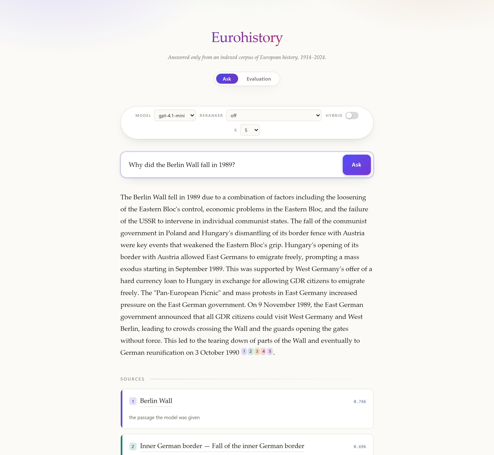

# eurohistory-rag

A retrieval-augmented generation system over 20th- and 21st-century European
history, built from English Wikipedia. Ask it a question in plain language; it
finds the passages that answer it and writes from those, citing the exact
article revision it read — or refuses, when the corpus does not cover the
question.

Built from scratch — no LangChain, no LlamaIndex — one measured phase at a time.
**Every number in this file comes from a saved evaluation run in `eval/runs/`,
and every one of them can be recomputed offline for free.**



---

## Contents

[Features](#features) · [Quick start](#quick-start) · [Configuration](#configuration) ·
[Usage](#usage) · [Results](#results) · [Architecture](#architecture) ·
[Testing](#testing) · [Project structure](#project-structure) ·
[Roadmap](#roadmap) · [Licence](#licence)

---

## Features

- **Answers with checkable citations.** Every chunk carries the revision id of
  the article it came from, so a citation links to the version that was
  indexed, not to whatever the page says today. 0 broken citations across 106
  questions.
- **Refuses rather than guesses.** 14 of the 106 evaluation questions have no
  answer in the corpus. The system refuses 10 of them and is scored on it.
- **Hybrid and temporal retrieval, both switchable.** Dense vectors, BM25
  keyword search fused by reciprocal rank, and a date-aware arm that reads the
  year out of the question. Each has a measured before/after in
  `docs/decisions.md`; two are off by default because measurement said so.
- **Conversation.** A follow-up like "and what happened next?" is rewritten into
  a standalone question before retrieval — which took follow-up recall@5 from
  46.2% to 92.3%.
- **A web page with the knobs exposed.** Model, reranker, `k` and hybrid can be
  changed per request, and a full evaluation run can be started from the
  browser — behind a written prediction and a cost ceiling.
- **Cost ceilings enforced in code**, per run and per UTC day, checked before
  the first call rather than in a confirmation dialog.
- **Streaming answers**, so the first words arrive in ~1.2 s against a ~4.0 s
  complete answer.
- **An evaluation harness that is the point of the project**: 106 hand-written
  questions with hand-written ground truth, five suites, a regression gate, an
  offline rescorer, a free retrieval sweep, and an LLM judge that must pass its
  own probe before its verdicts count.

---

## Quick start

**Be honest with yourself about which of these you want.** The first costs
nothing and proves the results. The second gets you a running system and costs
about 25 minutes and $0.26.

### See that it works — free, offline, no key, no Docker

The corpus is not in this repository (`data/` is gitignored and holds 56,324
chunks), but **31 complete evaluation runs are**, with every question, every
retrieved chunk, and every answer.

```bash
uv sync
uv run eurohistory rescore eval/runs/2026-08-11T0635Z
```

That recomputes every figure in [Results](#results) from the saved run. It
spends nothing and reaches no network. `uv run pytest` — 842 tests — also passes
with Docker stopped, no API key, and no model downloaded.

### Run it for real — an OpenAI key, Docker, ~25 minutes, ~$0.26

There is no shortcut here and pretending otherwise would waste your time: the
index has to be built once on your machine, because an image carrying 56,324
embedded chunks is not an image anyone would pull.

```bash
cp .env.example .env          # add your OpenAI key and a contact User-Agent
docker compose up -d          # Qdrant
uv sync
uv run eurohistory curate     # seeds.toml -> corpus/registry.csv     free
uv run eurohistory ingest     # Wikipedia  -> data/bronze/    free, ~15 min
uv run eurohistory silver     # clean and deduplicate         free, ~1 min
uv run eurohistory chunk      # split into 56,324 chunks      free, ~1 min
uv run eurohistory index      # embed and upload             ~$0.26, ~6 min
```

Then start the API — either on the host:

```bash
uv run uvicorn eurohistory_rag.api.main:app --reload
```

or in a container, which brings Qdrant with it:

```bash
docker compose --profile app up -d --build
```

Open `http://127.0.0.1:8000`. `/ready` returns 503 until the collection exists,
which is the honest answer before `index` has run.

**[Full operator guide →](docs/operating.md)** — prerequisites, what each stage
costs, the spend ceiling, and every switch that changes an answer.

---

## Configuration

Everything is environment variables, read once at startup into a typed
`Settings` object. Unknown keys are a startup error rather than a silent
no-op. Copy `.env.example`, which documents all of them.

| Variable | Default | What it does |
|---|---|---|
| `OPENAI_API_KEY` | *required* | Embeddings and generation |
| `WIKIPEDIA_USER_AGENT` | *required* | MediaWiki blocks requests without a contact address |
| `QDRANT_URL` | `http://localhost:6333` | `http://qdrant:6333` inside the container |
| `GENERATION_MODEL` | `gpt-4.1-mini` | Chosen in D-052; a 4.1 because gpt-5 rejects `temperature=0` and a repeatable eval is worth more than newness |
| `RERANKER_ENABLED` | `false` | Off since D-108 — it cost 29 points of recall on reworded questions |
| `HYBRID_ENABLED` | `false` | BM25 fused with the dense results; needs an index built with sparse vectors |
| `TEMPORAL_ENABLED` | `false` | Date-filtered third arm; gate failed in D-096 |
| `VERIFY_ENABLED` | `false` | Checks every claim against its sources; doubles cost and latency |
| `MAX_RUN_DOLLARS` | `0.50` | Refuses one evaluation whose quote exceeds it |
| `MAX_DAY_DOLLARS` | `1.00` | What this machine may spend in a UTC day, across everything |

**[Every knob, and what changing it costs →](docs/tuning.md)**

### The reranker is an optional install

The local cross-encoder needs `sentence-transformers`, which pulls torch, CUDA
and triton. Measured on the Linux image: **8.89 GB with it, 732 MB without** —
4.7 GB of the difference is a CUDA stack a CPU container can never use. Since
the reranker is off by default it is an extra, not a dependency:

```bash
uv sync --extra reranker      # only if you want RERANKER_ENABLED=true
```

Without it, `RERANKER_ENABLED=true` fails cleanly at `/ready` instead of
crashing a search.

---

## Usage

### The web page

`http://127.0.0.1:8000` — ask a question, see the passages it was given and
their scores, change the model or `k` per request, and run a full evaluation
from the Evaluation tab.

### The HTTP API

```bash
curl -s -X POST http://127.0.0.1:8000/ask \
  -H "Content-Type: application/json" \
  -d '{"question":"Why did the Berlin Wall fall in 1989?"}'
```

Returns the answer, the numbered sources with their scores and revision-pinned
URLs, the model used, and the corpus licence. `/search` returns retrieval alone;
`/ask/stream` streams tokens; `/health` is liveness and `/ready` is readiness,
deliberately separate.

### The command line

```bash
uv run eurohistory evaluate              # 106 questions -> eval/runs/<id>/   costs money
uv run eurohistory rescore <run-dir>     # recompute metrics offline          free
uv run eurohistory gate <old> <new>      # exits non-zero on any regression   free
uv run eurohistory sweep --baseline <d>  # many retrieval settings, no generation
uv run eurohistory judge-probe           # validate the judge before trusting it
uv run eurohistory judge <run-dir>       # faithfulness over a saved run       costs money
```

---

## Results

106 questions across five suites, scored against hand-written ground truth.
Newest run, [`2026-08-11T0635Z`](eval/runs/2026-08-11T0635Z):

| | |
|---|---|
| Right source in the top 5 (`recall@5`) | **85.9%** |
| Right source in the top 20 (`recall@20`) | **97.8%** |
| All expected sources in the top 5 (`coverage@5`) | **64.5%** |
| Questions naming a value whose answer states it (`fact_rate`) | **94.7%** |
| Correctly refused | **11 of 106** |
| Answers with a broken or missing citation | **0** |
| Cost of the full run | **$0.1374** ($0.0013 per question) |
| Median time to a complete answer | **4,049 ms** |

`coverage@5` is the weak one and it is the honest number to look at: when a
question needs three sources, it usually gets one or two of them.

**[Read the evidence →](docs/evidence.md)** — what each number means without the
jargon, the numbers that are weak, the one question of 92 that has never been
retrieved, and the four checks the most recent change *failed*.

### Why these numbers are worth more than most benchmark tables

- **The predictions were written down before the measurements.** Every phase
  from 8 onward states in [`docs/decisions.md`](docs/decisions.md) what a good,
  a bad, and an *impossible* result would be — before the command runs. The
  third one is the useful one: in Phase 8 a recall figure fell in a way that
  was arithmetically impossible, and that is what exposed a broken model.
- **The failures are in the same file as the wins.** Phase 32 built HyDE,
  measured it, and it lost — to switching an existing component off, which had
  been quietly costing 29 points of recall on reworded questions since Phase 8.
  Both are written up in D-108.
- **There is a tool whose job is to fail.** `eurohistory gate` exits non-zero on
  any regression. The most recent change failed it on four checks and shipped
  anyway, with the reasoning published in `eval/runs/gate-D-108.txt`.
- **31 runs are kept on disk with full transcripts**, so any published figure
  can be recomputed by a stranger.

---

## Architecture

Two paths that share almost nothing. `api/` never imports `pipeline/`.

```
BUILD  (offline, occasional)
  seeds.toml -> registry.csv -> bronze/ -> silver/ -> gold/ -> Qdrant
     themes     article list    raw wiki   cleaned   chunks   vectors

QUERY  (every question, milliseconds)
  question -> rewrite -> embed -> search -> thin -> prompt -> answer
```

Only `data/bronze/` is irreplaceable. Silver, Gold and the Qdrant collection are
caches that can be deleted and rebuilt, which is what makes changing the
chunking cheap — and it has been changed several times.

**[Architecture →](docs/architecture.md)** — the two paths in full, what an
embedding is actually doing, and where it breaks.

---

## Testing

```bash
uv run pytest           # 842 tests — no network, no Docker, no API key, no model
uv run ruff check .
uv run ruff format --check .
uv run mypy src tests   # strict
```

The suite runs offline by design: `QdrantClient(":memory:")`, a fake embedder
and a fake generator. A test that needed the network would be a test that never
ran in CI.

CI runs all of the above on every push, plus a test that pins the scoring code
to the figures already published — so the metrics cannot quietly start reporting
something different about runs that were measured months ago. The evaluation
itself is deliberately not in CI: it needs a filled Qdrant, a key and real
money, and D-089 records that correction.

---

## Project structure

```
├── docs/                  the record: decisions, evidence, architecture, tuning
├── eval/
│   ├── questions.toml     106 questions and their hand-written ground truth
│   └── runs/<id>/         31 saved runs — meta, records, summary, transcript
├── src/eurohistory_rag/
│   ├── api/               the web layer — imports retrieval/, never pipeline/
│   ├── cli/               the pipeline's trigger
│   ├── core/              config, logging, tracing, the spend ledger
│   ├── eval/              questions, runner, metrics, gate, sweep, judge
│   ├── generation/        prompt, model client, answer service — the /ask path
│   ├── pipeline/          bronze/ silver/ gold/ index/ — the offline build
│   └── retrieval/         embedding, vector store, search — the query path
├── tests/                 842 tests
└── data/                  gitignored; only bronze/ is irreplaceable
```

**Stack:** `uv`, `fastapi`, `polars`, Parquet, `qdrant`, `openai`
(`text-embedding-3-small` at 1536 dims, `gpt-4.1-mini`), `typer`,
`mwparserfromhell`, `pytest` / `ruff` / `mypy --strict`.

---

## Roadmap

Work is queued only against a named failure in the evaluation, and no phase ends
without a before/after number. Next up:

| | | Why |
|---|---|---|
| 34 | The cleaner's blanks | `{{convert}}` is dropped, so a sentence ends in a hole the model fills and cites — the most serious known correctness defect here |
| — | A temporal-aware reranker | The reranker is right for questions naming a year and wrong for reworded ones; the signal is already parsed |
| — | Parent document retrieval | `coverage@5` is 64.5% against `recall@20` of 97.8% |

**[Roadmap →](docs/roadmap.md)** — including the techniques deliberately *not*
adopted, and why.

---

## Licence

[MIT](LICENSE) for the code, the evaluation questions and the saved runs.

**The corpus is not covered by it.** Article text comes from English Wikipedia
under [CC BY-SA 4.0](https://creativecommons.org/licenses/by-sa/4.0/), with its
attribution and share-alike obligations intact. The API states this on every
response.
